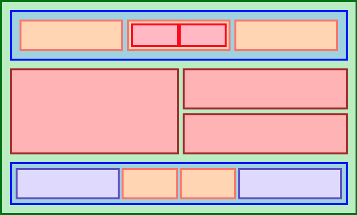

# Flexbox Challenge

This is a project to _showcase_ my **CSS Flexbox skills** by challenging myself to
recreate the image below:

<!---->

### CSS Flexbox Skills

I am referencing [The Odin Project](https://www.theodinproject.com/paths/foundations/courses/foundations), as well as, the [CSS Flexbox Layout Guide](https://css-tricks.com/snippets/css/a-guide-to-flexbox).

The following is just a quick guide that I can refer to when using flex containers to layout flex items.

- properties to manage flex containers:
  - `display: flex;` to define the container
  - `flex-direction: row (default) | column` to set the main axis defining flex item layout (horizonally or vertically)
  - `flex-wrap: wrap` to allow items to wrap to new line, if needed
  - `justify-content: ` to align items on their main axis (depends on flex-direction)
  - `align-items: ` to align items on their cross axis (again, depends on flex-direction)
  - `gap: ` to add space between items

- properties to manage flex items;
  - `flex-grow: ` determines how much of available container space item should occupy
  - `flex-shrink: ` ability of item to shrink
  - `flex-basis: ` defines default item size before available container space is distributed
	 - `flex-basis: auto` (default) will respect an item's declared width and/or height regardless of `flex-direction`
	 - `flex-basis: 0` will ignore item's width (if `flex-direction: row;`) and height (if `flex-direction: column;`)

- `flex: ` shorthand
  - `flex: 0 1 auto;` default
  - `flex: 1;` expands to `flex: 1 1 0;` 
  - `flex: auto;` expands to `flex: 1 1 auto;`